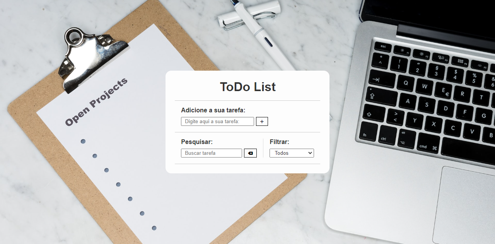
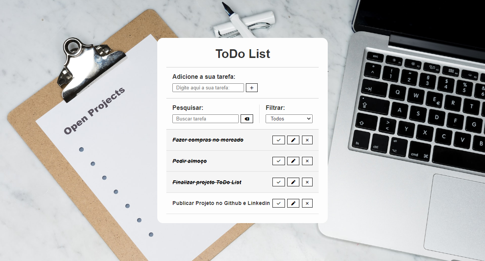

# toDo-List
>Aplicativo Web para anotações de tarefas

<!------------------------------------STACKS-->
#### Stacks:

 <a href="https://developer.mozilla.org/pt-BR/docs/Web/HTML"><a/>
   <a href="https://developer.mozilla.org/pt-BR/docs/Web/CSS"><a/>
    <a href="https://github.com/braziljs/eloquente-javascript"><a/>
   

  
  <!------------------------------------TOOLS-->
 #### Tools:
 <a href="https://code.visualstudio.com/"><a/>
  
  
  
   <!------------------------------------DESCRIPTION-->

#   Sobre o projeto <!---write here : talk a little about project: what's does, example.  -->
> Clássico bloquinho de anotações online. O ToDo List é uma ótima alternativa para realizar anotações rápidas e que no final do dia será prazeroso ver o checklist todo completo.
> O desenvolvimento deste projeto se deu a partir do interesse em aperfeiçoar mais o conhecimento sobre funções e eventos no JavaScript, além de praticar HTML e CSS.

>Link para acessar o projeto no ar: https://joaovporfirio.github.io/toDo-List/

>Possíveis melhorias: Salvamento de dados em memória, correção de bug entre a área de busca por letra/palavra e filtro select.
  
  # Conhecimentos utilizados

-HTML usado para desenvolvimento da estrutura.
 
-CSS para estilização e responsividade.
 
-JavaScript para consumumo da API de clima
 
-Responsividade para desktop e mobile.

# Feedback do projeto

Este projeto gerou alguns desafios como implementar o filtro select, busca por letra/palavra e também para realizar a edição de alguma task já adicionada.
